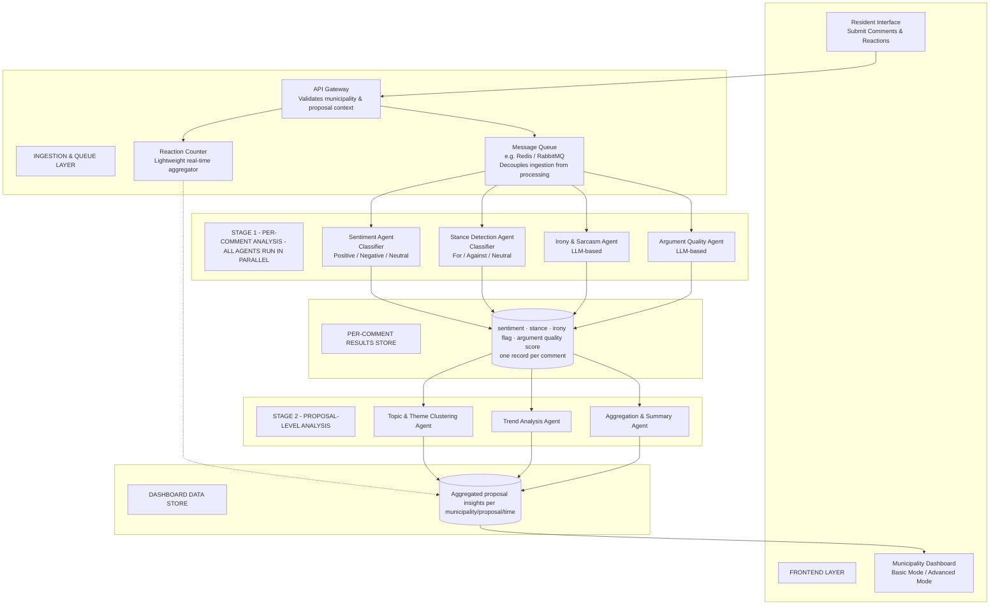

# Municipal Civic Insights Pipeline

AI-assisted analytics pipeline for municipality proposal feedback.

This project models a two-stage architecture for processing resident comments and reactions on public proposals:

- Frontend layer for resident submissions and municipality dashboards
- Ingestion and queue layer for validation, decoupling, and real-time reaction counting
- Stage 1 parallel per-comment analysis:
  - Sentiment classification
  - Stance detection
  - Irony/sarcasm detection
  - Argument quality scoring
  - Profanity detection
  - Toxicity scoring
  - Civility scoring
  - Argument structure scoring
  - Evidence support scoring
  - Topical relevance scoring
- Stage 2 proposal-level analysis:
  - Topic/theme clustering
  - Trend analysis over time
  - Aggregated natural-language summaries
- Dashboard data store serving municipality-facing insights

## Core Objective

Turn high-volume civic feedback into structured, proposal-level insight that municipalities can monitor in near real time and use for decision support.

Research grounding for Stage-1 agent definitions is documented in [docs/research/agent_rubric.md](./docs/research/agent_rubric.md).

## Architecture (Mermaid)

